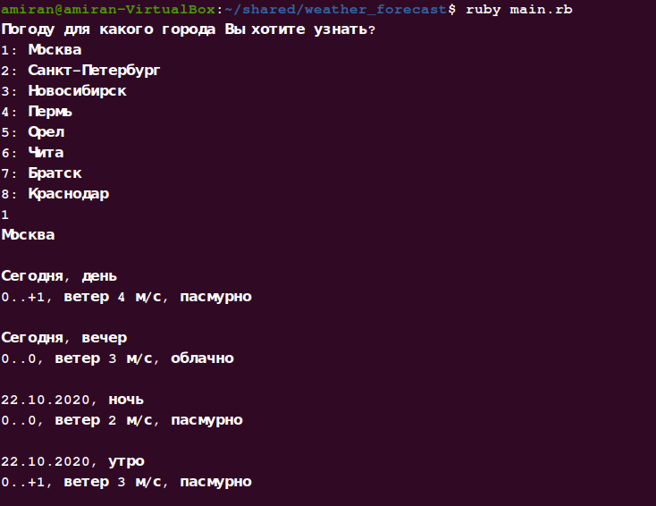

# Прогноз погоды на Руби!
Это простая программа на руби `(v. 2.7.1)`, которая позволяет узнать, какая нынче погода в 8 городах
нашей необъятной родины, а именно: Москва, Санкт-Петербург, Новосибирск, Пермь, Орёл,
Чита, Братск, Краснодар.

Для парсинга использовались гемы `rexml` и `net/http`

## Как установить
```
git clone git@github.com:Giasod/weather_forecast.git
cd ./weather_forecast
ruby main.rb
```
Вуаля, вы восхитительны!

Пример работы приложения:


